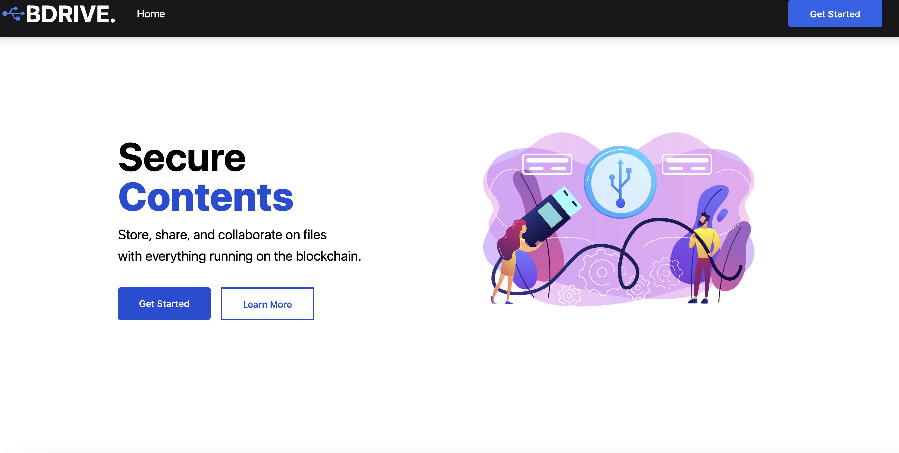

<div align="center">
    

  <h3 align="center">BDrive PolygonStore</h3>

  <p align="center">
    File storage platform with Blockchain!
    <br />
    <a href="https://github.com/kwakyebrilliant/Bdrive"><strong>Explore the docs »</strong></a>
    <br />
    <br />
    
  </p>
</div>

<!-- ABOUT THE PROJECT -->

## About The Project



# What it does
Making use of blockchain technology, we present to you BDrive PolygonStore , a storage application that seeks to secure contents of users with blockchain. By doing so, we offer you an easy way to upload files, view them and also share with other users. And what we seek to achieve is to safeguard and protect contents of users with blockchain technology.

Once a user get on the platform, he or she will be able to perform an activity by clicking on the "Get Started" button. They will be prompted to connect their metamask wallet to the platform and if they do not have, they will be required to install the metamask extension.  At the summary page, the user then can click on the upload button and provide the details of the upload and proceed to upload their contents. There are pages like mydrive, shared with others and many more. All these pages are on the platform to make the platform complete. 
Please note: add polygon matic to metamask testnet to be able to perform an activity on the platform.
All media are stored on IPFS.


# Built With
This section should list any major frameworks/libraries used to bootstrap your project. Leave any add-ons/plugins for the acknowledgements section. Here are a few examples.
- [React.js](https://reactjs.org/)
- [React-Bootstrap](https://react-bootstrap.github.io/)
- [TailwindCSS](https://tailwindcss.com/docs/guides/create-react-app)
- [Solidity](https://docs.soliditylang.org/en/v0.8.13/)
- [IPFS](https://ipfs.io/)

# Getting started
The project consist of the backend and also the front end.

### Prerequisites
- nodejs installed
- npm
- Hardhat
 ```
npm install npm@latest -g
npm install -g hardhat
```

### Local setup
To run this project locally, follow these steps.
1. Clone the project locally, change into the directory, and install the dependencies:
```
git clone https://github.com/kwakyebrilliant/Movers

cd BDrive

# install using NPM or Yarn
npm install

# or

yarn
```

2. Start the local Hardhat node

```sh
npx hardhat node
```

3. With the network running, deploy the contracts to the local network in a separate terminal window

```sh
npx hardhat run scripts/deploy.js --network localhost
```

4. Start the app

```
npm run dev
```

### Configuration

The chain ID should be 80001. If you have a localhost rpc set up, you may need to overwrite it.

To deploy to Polygon test or main networks, update the configurations located in **hardhat.config.js** to use a private key and, optionally, deploy to a private RPC like Infura.

```javascript
// require("@nomicfoundation/hardhat-toolbox");
/* hardhat.config.js */
require("@nomiclabs/hardhat-waffle");
const fs = require("fs");
// const privateKey = fs.readFileSync("secret.txt").toString();
const projectId = "8b7ba5517c414450a93ec7334975a7fe";
const privatekey1 =
  "";
const privatekey2 =
  "";
const privatekey3 =
  "";
const privatekey4 =
  "";
module.exports = {
  defaultNetwork: "hardhat",
  networks: {
    hardhat: {
      chainId: 1337,
    },

    mainet: {
      url: `https://palm-mainnet.infura.io/v3/${projectId}`,
      // accounts: [privateKey],
    },
    matic: {
      url: "https://polygon-mumbai.g.alchemy.com/v2/2bGIFu-iEnl9RvAOTe1ddZI2gBnuYQGS",
      accounts: [privatekey1, privatekey2, privatekey3, privatekey4],
    },
  },
  solidity: {
    version: "0.8.17",
    settings: {
      optimizer: {
        enabled: true,
        runs: 200,
      },
    },
  },
};
```


If you have a suggestion that would make this better, please fork the repo and create a pull request. You can also simply open an issue with the tag "enhancement". Don't forget to give the project a star! Thanks again!
1. Fork the Project
2. Create your Feature Branch (`git checkout -b feature/AmazingFeature`)
3. Commit your Changes (`git commit -m 'Add some AmazingFeature'`)
4. Push to the Branch (`git push origin feature/AmazingFeature`)
5. Open a Pull Request

# License
Distributed under the MIT License.

# Contact
- Brilliant Kwakye - https://twitter.com/a_moah__
- Mends Albert - https://twitter.com/mendalbert
